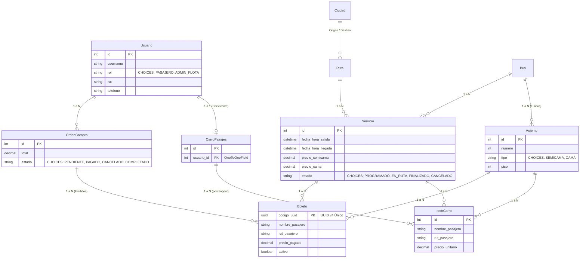

# 🚍 Sistema de Reservas de Pasajes de Buses Interurbanos (`buses_chile_backend`)

> **Evaluación Sumativa EVA-2 - Asignatura: Desarrollo Backend (Ponderación 25%)**  
> **Puntaje Total: 100 Puntos | Exigencia: 60% para Nota 4.0**  
> **Año Académico: 2026**

---

## 👨‍🎓 Información del Alumno y Presentación
* **Alumno:** `Rodrigo Gallardo`
* **Sección:** `AP-N4-C2(E-F)/D`
* **Año:** `2026`
* **Proyecto Asignado:** **Proyecto 4 - Reservas de Pasajes de Buses Interurbanos (Transporte)**
* **Documentación Interactiva Swagger:** `http://127.0.0.1:8000/api/docs/`
* **Vista Base y Footer Informativo:** `http://127.0.0.1:8000/` o `http://127.0.0.1:8000/api/info/`

---

## 🏗️ 1. Arquitectura y Stack Tecnológico

El sistema fue diseñado bajo una arquitectura modular desacoplada en capas (Controladores/Vistas, Servicios de Dominio Transaccional, Serializadores, Filtros Declarativos y Persistencia ORM), garantizando alta cohesión, bajo acoplamiento y cumplimiento estricto del estándar RESTful.

* **Lenguaje:** Python 3.10+ / 3.14
* **Framework Web & API:** Django & Django REST Framework (DRF)
* **Base de Datos:** PostgreSQL con conector nativo `psycopg2-binary` y motor `'django.db.backends.postgresql'`.
* **Autenticación y Autorización:** `djangorestframework-simplejwt` con inyección de **Claims Personalizados de Rol** (`role`, `username`, `user_id`) en el payload del access token.
* **Manejo de Roles (RBAC):** `Pasajero` (Cliente) y `Administrador de Flota` (`ADMIN_FLOTA`).
* **Filtrado Dinámico:** `django-filter` sobre catálogo por ciudad de origen, destino y fecha.
* **Documentación OpenAPI 3.0:** `drf-spectacular` con interfaz interactiva **Swagger UI**.
* **Transaccionalidad y Concurrencia:** Bloqueo pesimista a nivel de fila (`select_for_update()`) dentro de transacciones ACID atómicas (`db.transaction.atomic()`).

---

## 🗄️ 2. Modelo de Dominio y Base de Datos (PostgreSQL)

El diagrama relacional normalizado satisface los requerimientos de integridad referencial y modelado explícito con `CHOICES`:



---

## 🛡️ 3. Matriz de Roles, Permisos y Endpoints

| Método | Endpoint | Rol Requerido | Descripción |
| :--- | :--- | :--- | :--- |
| **GET** | `/` o `/api/info/` | Público | Datos del alumno, sección, año 2026 y enlaces base. |
| **POST** | `/api/token/` | Público | Login JWT. Retorna access token con `role`, `username`, `user_id`. |
| **POST** | `/api/token/refresh/` | Público | Refresco de token JWT. |
| **POST** | `/api/registro/` | Público | Registro de nuevo usuario con rol `PASAJERO`. |
| **GET** | `/api/servicios/buscar/` | Público | Búsqueda con `django-filter` por origen, destino, fechas y tarifas. |
| **GET** | `/api/servicios/{id}/asientos/` | Público | Mapa de asientos con disponibilidad en tiempo real (`disponible: true/false`). |
| **GET** | `/api/carro-pasajes/` | `Pasajero` | Ver carro de pasajes persistente y total. |
| **POST** | `/api/carro-pasajes/` | `Pasajero` | Agregar asiento con nombre y RUT del ocupante. |
| **DELETE** | `/api/carro-pasajes/{id}/` | `Pasajero` | Eliminar pasaje del carro. |
| **POST** | `/api/ventas/checkout/` | `Pasajero` | **Checkout Atómico:** Valida concurrencia con `select_for_update`, descuenta inventario, transiciona a `PAGADO`, emite boletos con UUID y vacía el carro. |
| **GET** | `/api/mis-boletos/` | `Pasajero` | Historial de pasajes adquiridos con su código UUID. |
| **POST** | `/api/servicios/` | `Admin Flota` | Crear nuevo itinerario de viaje. |
| **PUT/DELETE**| `/api/servicios/{id}/` | `Admin Flota` | Modificar o dar de baja un servicio. |
| **PATCH**| `/api/ventas/{id}/estado/` | `Admin Flota` | Cambiar estado (ej: a `CANCELADO`). **Reversión automática de inventario** (libera los asientos en el acto). |
| **GET/POST**| `/api/superadmin/usuarios/` | `Superusuario` | Listar todos los usuarios y crear administradores de flota con empresa asignada. |
| **PATCH**| `/api/superadmin/usuarios/{id}/privilegios/` | `Superusuario` | Conceder o revocar privilegios: cambiar rol (`ADMIN_FLOTA`/`PASAJERO`), empresa, staff y estado activo. |
| **GET** | `/api/docs/` | Público | Documentación interactiva Swagger UI. |

---

## 🚀 4. Guía de Instalación y Ejecución Rápida

### Requisitos Previos
* Python 3.10 o superior instalado.
* PostgreSQL 14+ (opcional: el sistema incluye conmutador automático para pruebas inmediatas).

### Paso 1: Clonar o ingresar al directorio del proyecto
```powershell
cd C:\Users\eDGe\Desktop\PruebaBackend2
```

### Paso 2: Crear y activar entorno virtual
```powershell
python -m venv venv
.\venv\Scripts\Activate.ps1
```

### Paso 3: Instalar dependencias
```powershell
pip install -r requirements.txt
```

### Paso 4: Configurar Base de Datos
En `settings.py` el motor nativo está configurado explícitamente en:
```python
DATABASES = {
    'default': {
        'ENGINE': 'django.db.backends.postgresql',
        'NAME': os.environ.get('DB_NAME', 'buses_chile_db'),
        'USER': os.environ.get('DB_USER', 'postgres'),
        'PASSWORD': os.environ.get('DB_PASSWORD', 'postgres'),
        'HOST': os.environ.get('DB_HOST', 'localhost'),
        'PORT': os.environ.get('DB_PORT', '5432'),
    }
}
```
> **Nota para evaluación rápida / testing local:**  
> Si se desea ejecutar sin levantar PostgreSQL en local, basta con fijar la variable `$env:USE_SQLITE="True"` en PowerShell antes de migrar.

### Paso 5: Aplicar migraciones
```powershell
python manage.py migrate
```

### Paso 6: Poblar datos de prueba (Seed Data)
El proyecto incluye un comando de gestión automatizado que crea usuarios con roles, ciudades, terminales, buses, asientos y servicios listos para probar:
```powershell
python manage.py poblar_datos
```

### Credenciales de Prueba Creadas Automáticamente:
| Usuario | Contraseña | Rol | RUT |
| :--- | :--- | :--- | :--- |
| `pasajero1` | `pasajero123` | `PASAJERO` | 18.345.678-9 |
| `pasajero2` | `pasajero123` | `PASAJERO` | 19.876.543-2 |
| `admin_flota1` | `admin123` | `ADMIN_FLOTA` | - |
| `admin` | `admin123` | Superuser / Admin | - |

### Paso 7: Ejecutar la Suite de Pruebas Automatizadas
Verifica el 100% de cumplimiento de los requerimientos:
```powershell
python manage.py test
```

### Paso 8: Iniciar el Servidor de Desarrollo
```powershell
python manage.py runserver
```
Acceder a:
* **Vista Base con Datos del Alumno:** `http://127.0.0.1:8000/`
* **Swagger OpenAPI:** `http://127.0.0.1:8000/api/docs/`
* **Panel de Administración:** `http://127.0.0.1:8000/admin/`

---
## 🧪 6. Ejemplos de Peticiones HTTP (cURL)

### 1. Iniciar Sesión (Login) y Obtener JWT con Claims
```bash
curl -X POST http://127.0.0.1:8000/api/token/ \
  -H "Content-Type: application/json" \
  -d '{"username": "pasajero1", "password": "pasajero123"}'
```
**Respuesta:**
```json
{
  "access": "eyJhbGciOi...",
  "refresh": "eyJhbGciOi...",
  "user_id": 3,
  "username": "pasajero1",
  "email": "juan.perez@correo.cl",
  "role": "PASAJERO",
  "nombre_completo": "Juan Pérez"
}
```

### 2. Buscar Servicios Disponibles
```bash
curl -X GET "http://127.0.0.1:8000/api/servicios/buscar/?origen_nombre=Santiago&destino_nombre=Valparaíso"
```

### 3. Consultar Asientos Libres y Ocupados de un Servicio
```bash
curl -X GET http://127.0.0.1:8000/api/servicios/1/asientos/
```

### 4. Agregar Asiento al Carro Persistente
```bash
curl -X POST http://127.0.0.1:8000/api/carro-pasajes/ \
  -H "Authorization: Bearer <TU_TOKEN_ACCESS>" \
  -H "Content-Type: application/json" \
  -d '{
    "servicio": 1,
    "asiento": 1,
    "nombre_pasajero": "Juan Pérez",
    "rut_pasajero": "18.345.678-9"
  }'
```

### 5. Ejecutar Checkout Atómico (Confirmar Compra y Pago)
```bash
curl -X POST http://127.0.0.1:8000/api/ventas/checkout/ \
  -H "Authorization: Bearer <TU_TOKEN_ACCESS>"
```

### 6. Consultar Mis Boletos Emitidos (con UUID)
```bash
curl -X GET http://127.0.0.1:8000/api/mis-boletos/ \
  -H "Authorization: Bearer <TU_TOKEN_ACCESS>"
```

### 7. Cambiar Estado a CANCELADO (Reversión de Inventario - Admin Flota)
```bash
curl -X PATCH http://127.0.0.1:8000/api/ventas/1/estado/ \
  -H "Authorization: Bearer <TOKEN_ADMIN_FLOTA>" \
  -H "Content-Type: application/json" \
  -d '{"estado": "CANCELADO"}'
```
